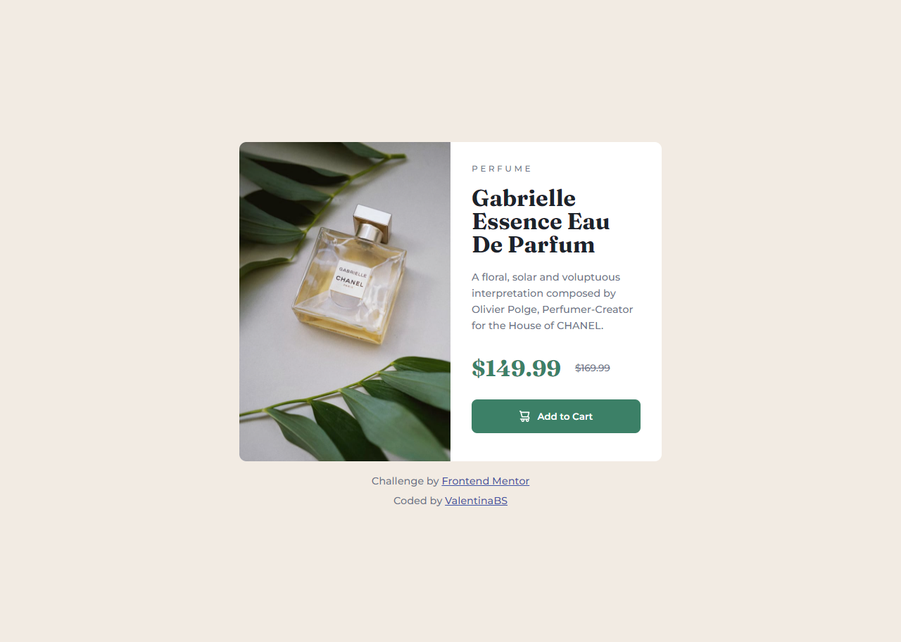
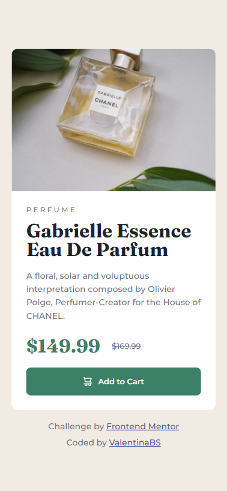

# Frontend Mentor - Product preview card component solution

This is a solution to the [Product preview card component challenge on Frontend Mentor](https://www.frontendmentor.io/challenges/product-preview-card-component-GO7UmttRfa). In this challenge I was able to keep practising some HTML and CSS concepts, while learning some new ones!

## Table of contents

- [Overview](#overview)
  - [The challenge](#the-challenge)
  - [Screenshots](#screenshots)
  - [Links](#links)
- [My process](#my-process)
  - [Built with](#built-with)
  - [Useful resources](#useful-resources)
- [Author](#author)

## Overview

### The challenge

Users should be able to:

- View the optimal layout depending on their device's screen size
- See hover and focus states for interactive elements

### Screenshots

My results (responsiveness included!) 

Project preview

### Links

- Solution URL: [Solution in Frontend Mentor]()
- Live Site URL: [Vercel Deploy]()

## My process

### Built with

- Semantic HTML5 markup
- CSS custom properties
- Flexbox
- Mobile-first workflow

### Useful resources

- [Picture tag resource](https://developer.mozilla.org/en-US/docs/Web/HTML/Element/picture) - This is an amazing article which helped me finally understand the use of the picture tag. I didn't know it was possible to change an image depending on the size of the page, using only HTML and CSS.

- [Style with uppercase instead of writing it](https://medium.com/@mandy.michael/why-you-shouldnt-write-your-content-in-uppercase-instead-use-css-b03ac2c65b99) - I had my doubts about the P E R F U M E text of the card, since that looks tricky for accesibility. I knew that I had to do the letter spacing in CSS, but I wasn't so sure about the uppercase. That's why this article was very helpful!

## Author

- Frontend Mentor - [@ValentinaBS](https://www.frontendmentor.io/profile/ValentinaBS)
- Github - [@ValentinaBS](https://github.com/ValentinaBS)
